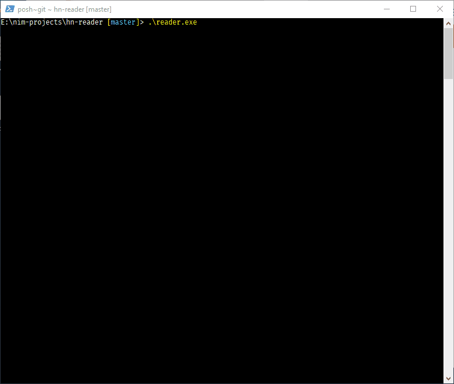

# Hacker News | reader

A simple, [Hacker News][hn] story reader, written in [Nim][nim] for the console.

## Compiling & Running

After cloning, assuming you have [Nim][nim] installed, compiling should be as simple as running:

```bash
$ nimble build
```

This will leave you with an executable `hnreader` app (`hnreader.exe` on Windows) in the `out/` directory that can then be run:

```bash
$ ./out/hnreader
```

## Usage

The program begins by downloading the latest top stories from [Hacker News][hn], sorting them by page rank, and then displaying as many as it can in the terminal. At the prompt, you can type `help` to get a list of commands available to you:

```
Hacker News | reader

COMMANDS
  load    [top|new|best|show|ask]     - reload stories (defaul=top)
  sort    [rank|time|score|comments]  - sort stories (default=rank)
  find    [topic]                     - search stories
  open    [n]                         - open story url in browser
  read    [n]                         - open comments in browser
  next                                - list next page of stories
  help
  quit
```

Any command and argument can be shortened as low as a single character (e.g. `load new` can be shortened to `l n`).

You can reload the list of stories at any time, sort them, search for a given topic through the [Hacker News][hn] history, paginate (`next`), or `open` them for in your default browser.



# fin.

Enjoy!

[hn]:     https://news.ycombinator.com
[nim]:    https://nim-lang.org
